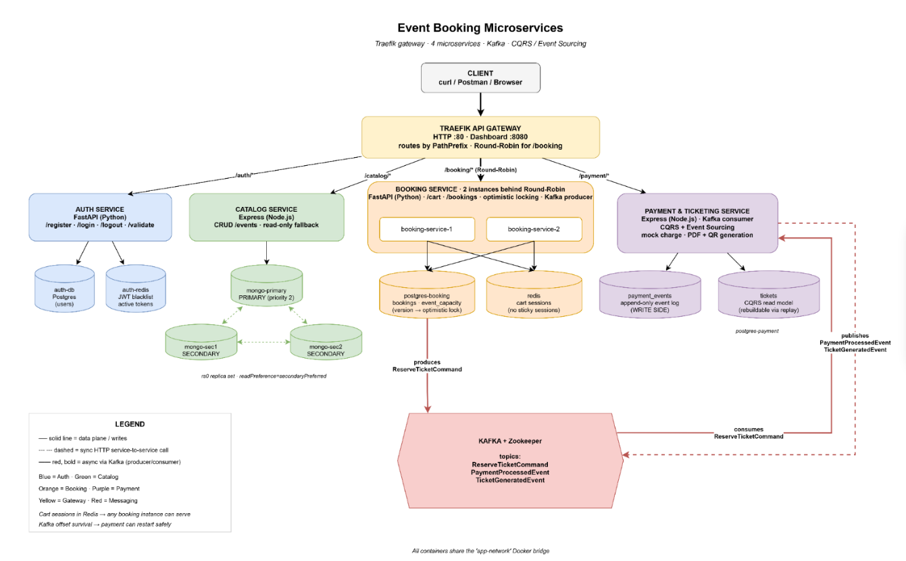

# Event Booking Microservices

End-to-end demo of a resilient microservices system: registration, event
catalog, cart/booking and asynchronous payment + PDF/QR ticket generation,
all behind a Traefik API Gateway.

## Architecture



| Service | Stack | DB | Reliability story |
|---|---|---|---|
| **Auth** | FastAPI | Postgres + Redis | JWT signed locally; logout writes blacklist key to Redis; if Redis is down, local validation still works (blacklist disabled) |
| **Catalog** | Node.js / Express | MongoDB 3-node replica set | Election on primary loss; if 2 nodes are down, service degrades to read-only and POST returns 503 |
| **Booking** | FastAPI × 2 instances | Postgres + Redis | Cart kept in Redis (no sticky sessions). Round-Robin via Traefik. Optimistic locking on seat reservation. |
| **Payment & Ticketing** | Node.js / Express | Postgres + Kafka | CQRS + Event Sourcing. Mock charge, PDF+QR generation. Survives crashes via Kafka offsets; read model can be rebuilt by replaying the event log. |

## Quick start

Prerequisites: Docker Desktop (with Compose v2).

```bash
docker compose up -d --build
docker compose ps                  # wait until everything is healthy
```

Then:

```bash
./scripts/seed-data.sh             # runs the full happy path
```

Open the Traefik dashboard at <http://localhost:8080>.
Import [`tests/project.postman_collection.json`](tests/project.postman_collection.json) into Postman for manual exploration.

## Failure scenarios (chaos demo)

Run individually:

```bash
./scripts/chaos.sh 1   # Mongo primary down -> election promotes secondary
./scripts/chaos.sh 2   # Mongo primary + secondary1 down -> Catalog becomes read-only
./scripts/chaos.sh 3   # Kill booking-service-1 -> cart survives on instance 2
./scripts/chaos.sh 4   # Kill auth-redis -> JWT still validates locally (no blacklist)
./scripts/chaos.sh 5   # Kill payment-service mid-flow -> Kafka buffers the message
./scripts/chaos.sh 6   # Replay event log -> CQRS read model rebuilt from scratch
```

…or interactively: `./scripts/chaos.sh` and pick a number.

### Inspecting Kafka manually

```bash
docker exec -it kafka kafka-console-consumer \
  --bootstrap-server localhost:9092 --topic ReserveTicketCommand --from-beginning

docker exec -it kafka kafka-console-consumer \
  --bootstrap-server localhost:9092 --topic TicketGeneratedEvent --from-beginning
```

### Inspecting the Auth blacklist

```bash
docker exec -it auth-redis redis-cli KEYS 'bl_*'
```

### Inspecting the Event Store

```bash
curl http://localhost/payment/events?limit=50 | jq .
docker exec -it postgres-payment psql -U payment_user -d paymentdb \
  -c "SELECT id, event_type, aggregate_id, occurred_at FROM payment_events ORDER BY id;"
```

## Endpoints reference

| Verb + Path | Description |
|---|---|
| `POST /auth/register` | Register a user |
| `POST /auth/login` | Returns `{access_token}` |
| `POST /auth/logout` | Blacklists the token |
| `GET  /auth/validate?token=…` | Validates a token; used by other services |
| `GET  /catalog/events` | List events (paginated) |
| `POST /catalog/events` | Create event (writes to Mongo primary) |
| `GET  /booking/cart` | Cart for current user (returns `servedBy` instance id) |
| `POST /booking/cart/items` | `{eventId, quantity}` |
| `POST /booking/bookings` | Checkout → publishes `ReserveTicketCommand` |
| `GET  /payment/tickets/me` | List my tickets (CQRS read model) |
| `GET  /payment/tickets/:id` | One ticket (by ticket-id or booking-id) |
| `GET  /payment/tickets/:id/pdf` | Download ticket PDF (with QR) |
| `GET  /payment/events` | Append-only event log (Event Sourcing) |
| `POST /payment/admin/replay` | Rebuild the `tickets` read model from the event log |

### Optional: protected catalog writes

Catalog ships with a JWT auth middleware (`catalog-service/src/middleware/auth.js`)
that delegates to `auth-service/validate`. It is **opt-in** — disabled by default
to keep the demo path simple. To turn it on:

1. In `docker-compose.yml`, add `AUTH_REQUIRED: "true"` to the `catalog-service` `environment:` block.
2. Apply the middleware in `catalog-service/src/routes/events.js` (e.g. `router.post('/', authMiddleware, ...)`).
3. Rebuild: `docker compose up -d --build catalog-service`.

After that, write endpoints (`POST/PATCH/DELETE /catalog/events`) require
`Authorization: Bearer <token>`; reads stay public.

## Repository layout

```
auth-service/         FastAPI + Postgres + Redis (JWT)
catalog-service/      Node + MongoDB Replica Set
booking-service/      FastAPI x 2 + Postgres + Redis + Kafka producer
payment-service/      Node + Postgres + Kafka consumer + PDF/QR  (CQRS + Event Sourcing)
gateway/              Traefik reference config (live config is in docker-compose labels)
scripts/              chaos.sh and seed-data.sh
tests/                Postman collection
docker-compose.yml    One-shot launcher for the whole stack
```

## Team

| Person | Service | Stack |
|---|---|---|
| 1 | Auth Service + API Gateway | Python · Postgres · Redis · Traefik |
| 2 | Catalog Service | Node · MongoDB Replica Set |
| 3 | Booking Service | Python · Postgres · Redis · Kafka |
| 4 | Payment & Ticketing Service | Node · Postgres · Kafka · CQRS / Event Sourcing |
